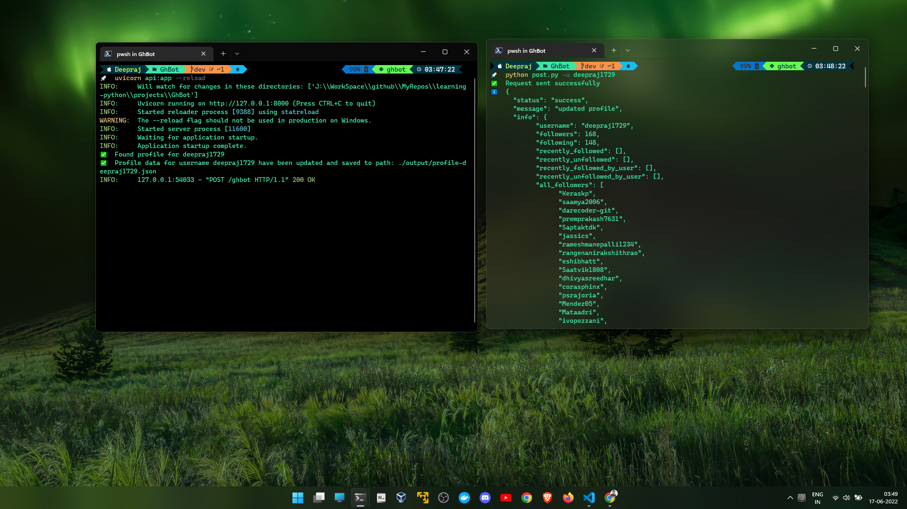

# GhBot

A simple github bot to retrieve data from github and track user activity:

## Tools Used:
- BeautifulSoup
- Requests
- FastAPI
- Flask

## Installation

Clone the project:

    git clone https://github.com/jassics/learning-python.git

Navigate to the `GhBot`:

    cd projects/GhBot/

Install using conda:

    conda create -n ghbot python=3.9

    conda activate ghbot

    pip install -r requirements.txt

## Run the application:
Run the Script:

    python main.py -u "your_github_username"

Run the API:

    uvicorn api:app --reload

Run the UI app:
    
    python app.py

Open browser and navigate to http://127.0.0.1:5000/

## API Testing:
1. Test the local api created with `fastapi` using python:
    
    python post.py -u "enter_github_username"

2. Test the local api with `CURL`:

For `Windows` users:

    curl -X POST -H "Content-Type: application/json" -d '{ \"text\" : \"deepraj1729\" }' http://127.0.0.1:8000/ghbot

For `Linux` and `Mac` users:

    curl -X POST -H "Content-Type: application/json" -d '{ "text" : "deepraj1729" }' http://127.0.0.1:8000/ghbot

3. Test the production api with `CURL`:

For `Windows` users:

    curl -X POST -H "Content-Type: application/json" -d '{ \"text\" : \"deepraj1729\" }' https://ghbot-api.herokuapp.com/ghbot

For `Linux` and `Mac` users:

    curl -X POST -H "Content-Type: application/json" -d '{ "text" : "deepraj1729" }' https://ghbot-api.herokuapp.com/ghbot

4. Useful formatting with python `json` library:

For `Windows` users:

    curl -X POST -H "Content-Type: application/json" -d '{ \"text\" : \"deepraj1729\" }' https://ghbot-api.herokuapp.com/ghbot | python -m json.tool

For `Linux` users:

    curl -X POST -H "Content-Type: application/json" -d '{ "text" : "jassics" }' https://ghbot-api.herokuapp.com/ghbot | python -m json.tool

